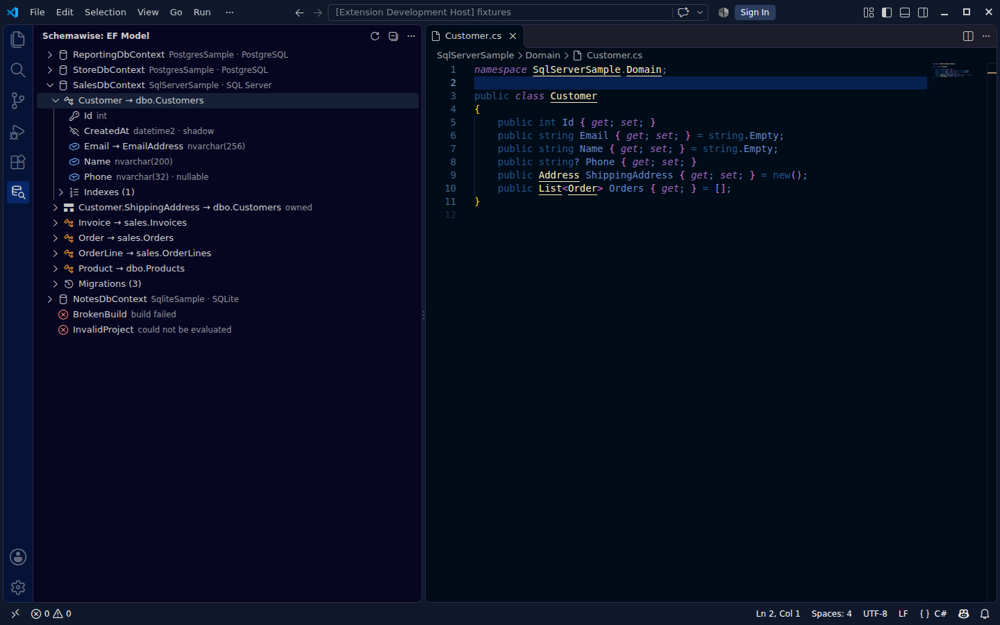
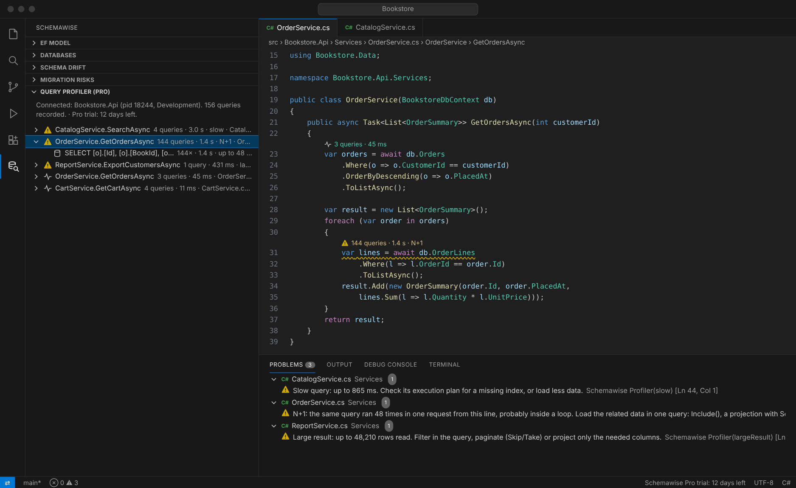
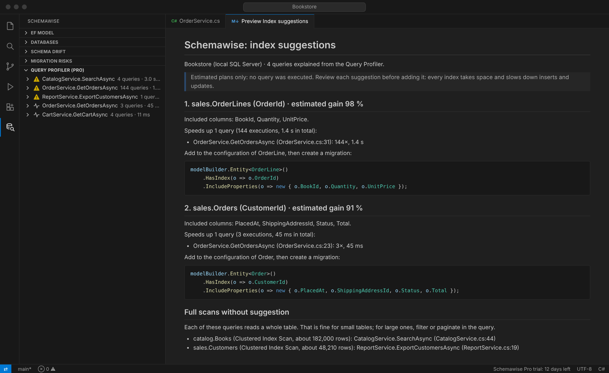
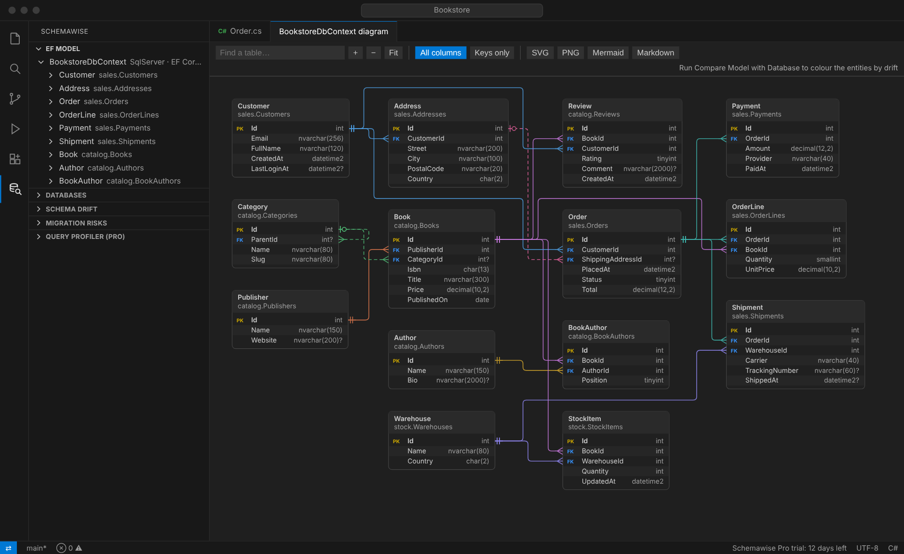
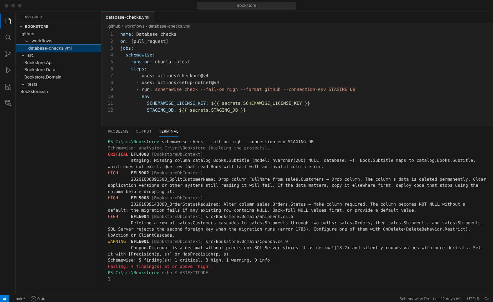

# Schemawise

**EF Core superpowers for VS Code.** Navigate. Compare. Migrate safely.

Schemawise is a VS Code extension for .NET developers using Entity Framework Core:

- **EF Model**: see the effective EF Core model (tables, columns, keys, indexes) and jump to the code.
- **Schema drift**: compare your model with a real SQL Server or PostgreSQL database.
- **Migration risks**: understand what a migration can break **before** you apply it.
- **Model checks**: mapping pitfalls SQL Server rejects or that silently lose data, in the Problems panel.

Everything runs locally: no source code, connection string, schema or data leaves your machine.

## Schemawise Pro: see what your queries really do

**Find the N+1 before your users do.** Start your app as usual: every SQL query EF Core runs shows up
at the line of code that runs it, with N+1 queries, slow queries and huge results flagged in the editor.
No package to add, no code to change.

**Index advisor**: the missing indexes of your real queries, read from estimated plans (never executed),
ranked by the time they would save, with the `HasIndex(...)` configuration to add.

**Database diagram and data dictionary**: every table, column and relationship of a DbContext, from
foreign key to primary key, exported as SVG, PNG, Mermaid or a Markdown data dictionary for your docs.

**CI check** (early access, the command-line package is coming to npm): `schemawise check` blocks the pull request that drops a column, makes a column required
on a table with NULLs, or ships a model SQL Server will reject, with annotations on the right lines.

Also in Pro: **fix drift** (the EF configuration or the SQL that closes each difference), **migration
conflicts between branches**, and the **migration status of every database**.

**Free for 14 days**, starting the first time you use a Pro feature: no account, no card. At the end, a
one-minute [survey](https://github.com/elite3448/schemawise/issues/new?template=pro-interest.yml) asks
whether you would like Pro to continue.

## Install

- **VS Code**: search for "Schemawise" in the Extensions view, or visit the
  [Visual Studio Marketplace](https://marketplace.visualstudio.com/items?itemName=eflens.schemawise).
- **Cursor, VSCodium, Windsurf**: [Open VSX](https://open-vsx.org/extension/eflens/schemawise).

Requires the .NET 8 runtime (or later) and the .NET SDK your projects need. Supports EF Core 8, 9
and 10 with SQL Server and PostgreSQL.

## Report a problem or suggest an idea

1. In VS Code, run **Schemawise: Copy Diagnostics** (it copies versions and statuses only: no code,
   connection strings or absolute paths).
2. [Open an issue](https://github.com/elite3448/schemawise/issues/new/choose) and paste it.

False positives (drift or migration risks reported wrongly) are the most useful reports.

## License

Schemawise is proprietary software; its core features are free: see [LICENSE.txt](LICENSE.txt) and
[THIRD-PARTY-NOTICES.txt](THIRD-PARTY-NOTICES.txt). This repository holds the public page, images
and issues; the source code is private.
